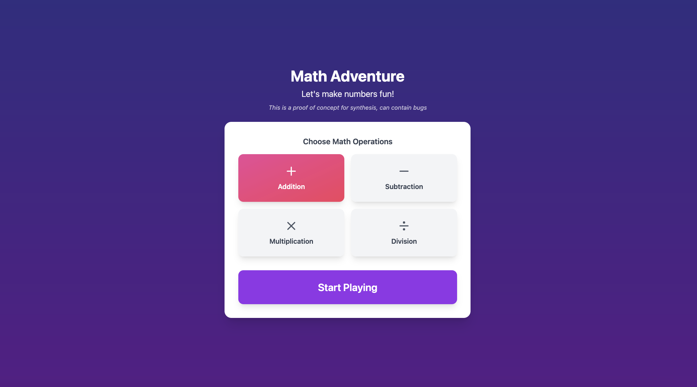

# Math Adventure

A beautiful and engaging math learning game built with React. Practice addition, subtraction, multiplication, and division in an interactive and fun environment.




## Features

- 🎯 Multiple operation modes (Addition, Subtraction, Multiplication, Division)
- 🎮 Interactive floating number bubbles
- 📈 Progressive difficulty levels
- ⭐ Achievement system
- ⏱️ Time-based challenges
- 🎵 Sound effects
- 🎨 Beautiful animations and transitions

## Getting Started

### Prerequisites

- Node.js (v14 or higher)
- npm or yarn

### Installation

1. Clone the repository:
```bash
git clone https://github.com/yourusername/math-adventure.git
cd math-adventure
```

2. Install dependencies:
```bash
npm install
```

3. Start the development server:
```bash
npm start
```

The game will be available at `http://localhost:3000`

## How to Play

1. Select the math operations you want to practice
2. Click floating number bubbles to solve equations
3. Complete levels to earn achievements
4. Try to beat your high score!

## Built With

- React
- TypeScript
- Framer Motion
- Tailwind CSS
- Recoil
- Webpack

## 📝 License

This project is licensed under the MIT License - see the [LICENSE](LICENSE) file for details.

## Acknowledgments

- Sound effects from [Mixkit](https://mixkit.co/)
- Icons from [Lucide](https://lucide.dev/)